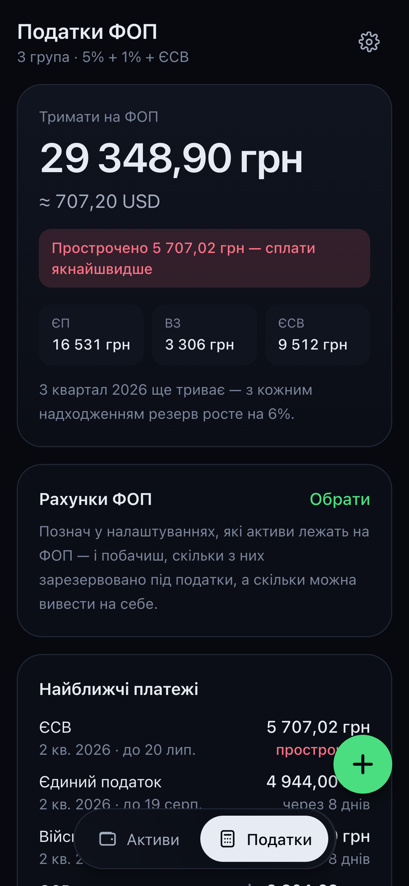
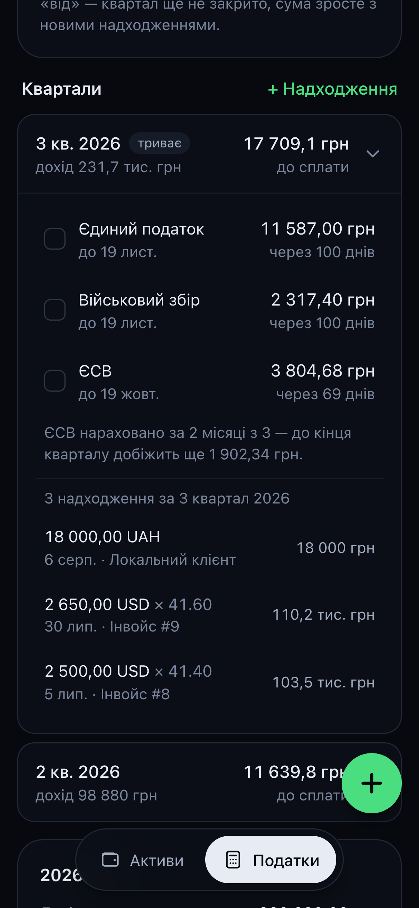
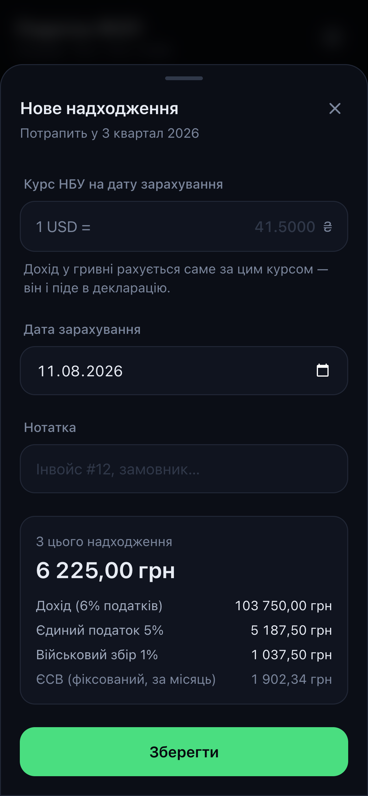

# Wallet

All your savings in one place: how much you have, where it sits, and in which currencies —
plus a tax tab that tells a Ukrainian sole proprietor (ФОП) how much to leave on the business
account for the next єдиний податок, військовий збір and ЄСВ payment.

```bash
npm install
npm run dev     # http://localhost:3000
```

## Screenshots

Captured at iPhone 12 Pro size (390 × 844 pt, @3x) with the demo data the app seeds on first run.

| Overview | Accounts | New asset |
| --- | --- | --- |
|  |  |  |

| Manual rates | Settings | Light theme |
| --- | --- | --- |
|  |  |  |

| Taxes | Quarter | New income |
| --- | --- | --- |
|  |  |  |

## Features

- **Total balance** in USD, with the hryvnia equivalent underneath.
- **Three views** of the same data: by account (Monobank, Binance, WhiteBIT, cash…),
  by currency (UAH, USD, USDT, BTC…), and by type (banks / crypto / cash).
- **Donut chart** — tap a segment to see the share and amount of that category.
- **History**: a snapshot of the total is stored once a day, which drives the monthly
  change and the chart.
- **Manual rates** — the arrows icon in the header. For hryvnia the field asks
  "1 USD = ? UAH", for expensive currencies "1 BTC = ? USD".
- **Hide amounts** — the eye icon, handy when someone is looking at your screen.
- **Light / dark theme** — settings offer System, Light and Dark; the choice is remembered.
- **JSON export / import** in settings.
- **Tax tab** for a ФОП on group 3 — see below.

## Taxes (ФОП, group 3)

The second tab answers one question: *how much of what sits on the business account is already
the state's?* Payments come in dollars, taxes go out in hryvnia, so the two accounts have to be
looked at together.

- **Log each incoming payment** — amount, currency, the NBU rate on the day it landed, and the
  date. That date decides the quarter; that rate decides the hryvnia income, exactly as in the
  declaration. The hryvnia rate from the wallet is pre-filled as a draft and can be overridden.
- **The reserve** — the headline number is everything accrued and not yet paid: 5% єдиний
  податок and 1% військовий збір on income to date, plus ЄСВ for every month that has started.
  Overdue amounts are called out separately.
- **Coverage** — mark which assets are ФОП accounts and the tab compares them against the
  reserve: what is free to move to yourself, and — when the hryvnia account alone doesn't cover
  the reserve — roughly how many dollars will have to be sold, with a configurable buffer for
  the rate moving before the payment date.
- **Deadlines** — єдиний податок and військовий збір 50 days after the quarter (20 May, 19 Aug,
  19 Nov, 19 Feb); ЄСВ by the 19th of the month after the quarter, shifted to the next working
  day. Each tax is ticked off as paid separately, per quarter.
- **The year** — income, taxes, the effective rate, and the group 3 limit (1167 minimum wages)
  as a progress bar, plus the share to set aside from every payment.

Defaults are the 2026 figures: minimum wage 8 647 ₴, ЄСВ 1 902,34 ₴/month, limit 10 091 049 ₴,
5% + 1%. All of them — including the 3% VAT rate and turning ЄСВ off if you're exempt — live in
the tab's settings, so a change in the law is a number to edit, not a release. Nothing here is
tax advice: it's arithmetic on numbers you enter.

## Install on your phone

The app ships a web manifest with `display: standalone`, so it can be installed and run
without browser chrome:

- **iOS / Safari** — Share → *Add to Home Screen*. It opens fullscreen, with the status bar
  tinted to match the current theme.
- **Android / Chrome** — the *Install app* prompt, or ⋮ → *Add to Home screen*.

Nothing is installed on a server: it stays the same static page, just launched from an icon.

## Data

Everything lives in this browser's `localStorage` (key `wallet.state.v1`) — nothing is sent
to a server. Clearing site data wipes your assets too, which is why settings include an
export to file.

The stored shape is versioned: a state saved before the tax tab existed keeps its assets and
gains an empty `fop` section on load, so nothing has to be re-entered.

On first run the app seeds demo assets and a few demo incomes (dated relative to today, so
they always land in the current quarters) to show what it looks like when filled in.
"Clear all" in settings removes them.

## Structure

| Path | What's inside |
| --- | --- |
| `src/lib/types.ts` | Models: `Asset`, `Category`, `Rates`, `FopIncome`, `WalletState` |
| `src/lib/defaults.ts` | Currencies, starting categories, default rates, tax defaults, demo data |
| `src/lib/compute.ts` | USD conversion, grouping, history, change over a period |
| `src/lib/fop.ts` | Quarters, tax amounts, deadlines, reserve, account coverage |
| `src/lib/useWallet.ts` | State + autosave to `localStorage` |
| `src/lib/walletContext.tsx` | The state lives in the root layout, so tabs switch without a reload |
| `src/lib/storage.ts` | Read/write, migration, export, import |
| `src/lib/theme.ts` | Theme mode, the pre-paint init script, `useTheme` |
| `src/components/` | Bottom sheet, chart, sparkline, tab bar, forms |
| `src/app/page.tsx` | Assets screen |
| `src/app/tax/page.tsx` | Taxes screen |
| `src/app/manifest.ts` | Web manifest that makes the app installable |

## Mobile

The layout is mobile-first: a single column up to `lg`, then a sticky left column with the
total and the chart, and the account list on the right. The two tabs sit in a floating pill
above the home indicator, and both screens share the same layout skeleton. `safe-area-inset` is handled on
iPhone, forms open from the bottom as a bottom sheet, every interactive element is at least
44px, and inputs use `font-size: 16px` so iOS doesn't zoom the page on focus. Scrollbars are
hidden everywhere — page and sheets alike — so it reads as an app rather than a web page;
scrolling itself is untouched.

## Theming

Both themes share one scale of `--color-ink-*` tokens; the light theme simply flips it, so
`bg-ink-900` and friends keep working in components without a single `dark:` variant. The
mode lives in `localStorage` under `wallet.theme.v1` and is applied by an inline script that
runs before the first paint, so a light-theme user never sees a dark flash on load.
