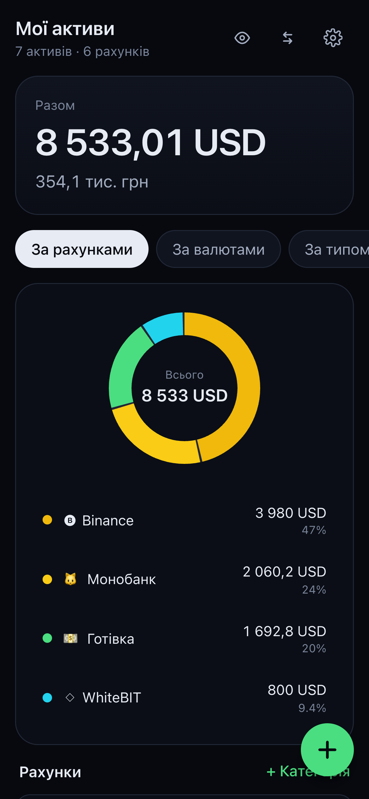
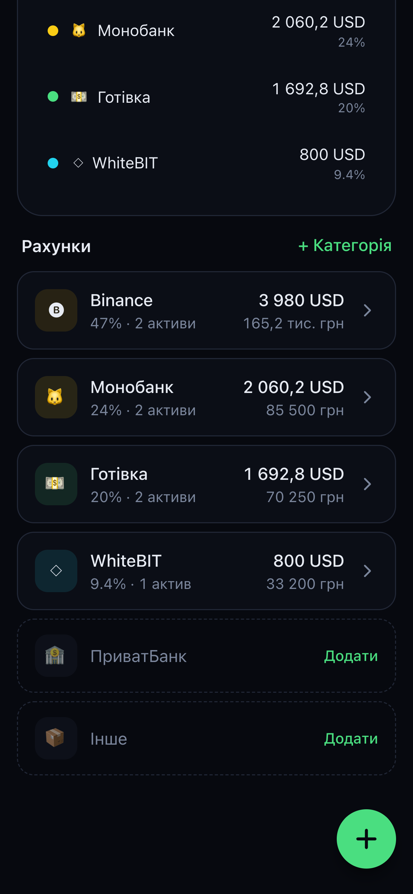
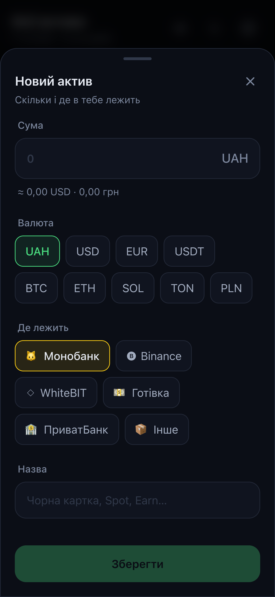
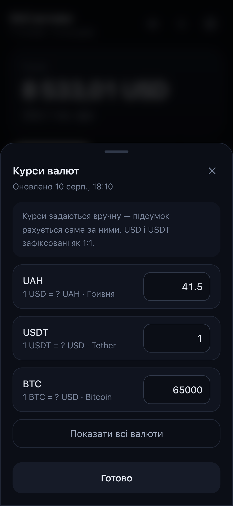
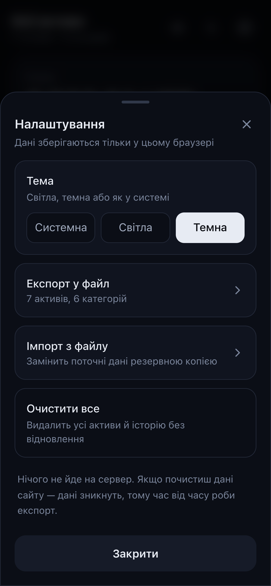
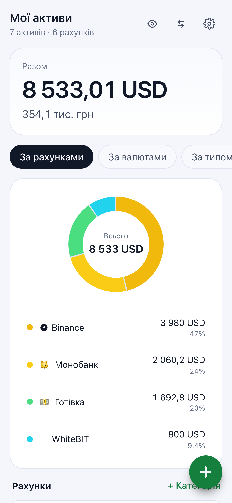

# Wallet

All your savings in one place: how much you have, where it sits, and in which currencies.

```bash
npm install
npm run dev     # http://localhost:3000
```

## Screenshots

Captured at iPhone 12 Pro size (390 × 844 pt, @3x) with the demo data the app seeds on first run.

| Overview | Accounts | New asset |
| --- | --- | --- |
|  |  |  |

| Manual rates | Settings | Light theme |
| --- | --- | --- |
|  |  |  |

## Features

- **Total balance** in USD, with the hryvnia equivalent underneath.
- **Three views** of the same data: by account (Monobank, Binance, WhiteBIT, cash…),
  by currency (UAH, USD, USDT, BTC…), and by type (banks / crypto / cash).
- **Donut chart** — tap a segment to see the share and amount of that category.
- **History**: a snapshot of the total is stored once a day, which drives the monthly
  change and the chart.
- **Manual rates** — the arrows icon in the header. For hryvnia the field asks
  "1 USD = ? UAH", for expensive currencies "1 BTC = ? USD".
- **Hide amounts** — the eye icon, handy when someone is looking at your screen.
- **Light / dark theme** — settings offer System, Light and Dark; the choice is remembered.
- **JSON export / import** in settings.

## Install on your phone

The app ships a web manifest with `display: standalone`, so it can be installed and run
without browser chrome:

- **iOS / Safari** — Share → *Add to Home Screen*. It opens fullscreen, with the status bar
  tinted to match the current theme.
- **Android / Chrome** — the *Install app* prompt, or ⋮ → *Add to Home screen*.

Nothing is installed on a server: it stays the same static page, just launched from an icon.

## Data

Everything lives in this browser's `localStorage` (key `wallet.state.v1`) — nothing is sent
to a server. Clearing site data wipes your assets too, which is why settings include an
export to file.

On first run the app seeds demo assets so you can see what it looks like when filled in.
"Clear all" in settings removes them.

## Structure

| Path | What's inside |
| --- | --- |
| `src/lib/types.ts` | Models: `Asset`, `Category`, `Rates`, `WalletState` |
| `src/lib/defaults.ts` | Currencies, starting categories, default rates, demo data |
| `src/lib/compute.ts` | USD conversion, grouping, history, change over a period |
| `src/lib/useWallet.ts` | State + autosave to `localStorage` |
| `src/lib/storage.ts` | Read/write, export, import |
| `src/lib/theme.ts` | Theme mode, the pre-paint init script, `useTheme` |
| `src/components/` | Bottom sheet, chart, sparkline, forms |
| `src/app/page.tsx` | Main screen |
| `src/app/manifest.ts` | Web manifest that makes the app installable |

## Mobile

The layout is mobile-first: a single column up to `lg`, then a sticky left column with the
total and the chart, and the account list on the right. `safe-area-inset` is handled on
iPhone, forms open from the bottom as a bottom sheet, every interactive element is at least
44px, and inputs use `font-size: 16px` so iOS doesn't zoom the page on focus. Scrollbars are
hidden everywhere — page and sheets alike — so it reads as an app rather than a web page;
scrolling itself is untouched.

## Theming

Both themes share one scale of `--color-ink-*` tokens; the light theme simply flips it, so
`bg-ink-900` and friends keep working in components without a single `dark:` variant. The
mode lives in `localStorage` under `wallet.theme.v1` and is applied by an inline script that
runs before the first paint, so a light-theme user never sees a dark flash on load.
